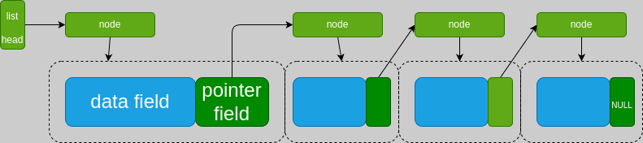

# Key

在c语言中，链表本质上是多个Node结构体通过指针域相连构成，为了方便地对Node进行操作，我们引入了头指针的概念，即使用一个指向链表的指针来操作链表，并将这样的指针即用来命名为**list(list head)**。



>  1. create a node
> 
>       | type | Node | Node* |
>       | -------- | -------- | -------- |
>       | scope    | main    | function    |
>       |code|`Node node;`|`Node* node = (Node*)malloc(sizeof(Node));`|
>  2. create a list `Node* list = NULL;`


## 头指针(List Head)

头指针：指向链表的位置，类型为`Node*`

以以下几个操作为例，说明头指针、链表、节点之间的关系：

```c
//创建空链表
Node* list = NULL;

//创建一个节点
Node node;

//头插法将节点插入链表
list->next=&node;
node->next=NULL;
```

>  - 当操作模块化为函数时，由于函数的参数传递机制，当涉及原链表元素修改时，需要传递头指针的地址，即`Node**`类型的指针，类似的，创建的Node也需要使用`Node*`类型来动态分配获取内存，这里通常将节点与**节点指针**混为一谈。[参考](pointer.md#as-prameter)
>  - 为方便编程，建议定义一个`typedef Node* NodePtr`，这样可以直接使用`NodePtr`来代替`Node*`，使代码更加简洁。**注意的是，虽然`Node*`也为list，但那样定义不够直观**

## 虚拟节点(Dummy Node)

虚拟节点：类型为`Node`的节点，不存放有效数据，只用于操作链表。

（以头插法的虚拟节点即头节点为例，尾插法则对应尾节点）

头节点：类型为`Node`的节点，表示链表的**”起点“**，是链表的第一个节点，但不是链表的第一个数据节点（首元节点）。

头节点的数据域可以为空，也可以存放链表的长度、类型等信息，但不存放链表的有效数据。其发挥主要作用的是**指针域**，使链表的操作统一，不需要对链表是否为空进行特殊处理。

>  1. the property of **Dummy**
>    - 头节点不是链表的必要组成部分，但是使用头节点可以使链表的操作更加统一。
>    - 头节点的指针域指向链表的首元节点，如果链表为空，则头节点的指针域为空，**但头节点本身保留**。
>  2. 头节点针对的是头插法，避免了链表为空时候，需要特殊处理的情况；类似的，尾插法也可以使用尾节点来避免链表为空时候的特殊处理。

*与头指针区别*

| \    | 头节点                     | 头指针                             |
| ---- | -------------------------- | ---------------------------------- |
| 类型 | **`Node`**                 | ~~`Node**`~~ `Node*`               |
| 作用 | 便于链表操作，**但非必要** | 指向整个链表位置，**一般必须存在** |
